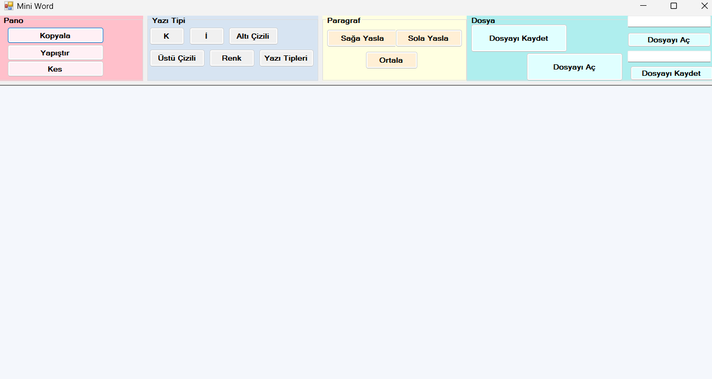

# Mini Word 

Bu proje, C# kullanılarak geliştirilmiş basit bir kelime işlemci uygulamasıdır. Uygulama, kullanıcıların metin belgelerini oluşturmasını, düzenlemesini ve biçimlendirmesini sağlayan temel özellikler sunar.



## Özellikler

- **Metin Biçimlendirme**: Metne kalın, italik, altı çizili ve üstü çizili stiller uygulama.
- **Metin Hizalama**: Metni sola, sağa veya ortalayarak hizalama.
- **Metin Rengi**: Seçili metnin rengini değiştirme.
- **Yazı Tipi Seçimi**: Yazı tipi ve boyutunu değiştirme.
- **Panoya Kopyala ve Yapıştır**: Panoya metin kopyalama ve yapıştırma işlemleri.
- **Dosya İşlemleri**: `.txt` formatında dosya açma ve kaydetme. RTF dosyaları oluşturma ve açma.
- **Hata Yönetimi**: Dosya zaten varsa veya dosyayı açarken sorun oluşursa kullanıcıyı bilgilendirme.


## Kullanım

1. **Uygulamayı Açın**: Uygulamayı başlatın.
2. **Belge Oluştur/Düzenle**: Sağlanan araçları kullanarak belge oluşturun veya düzenleyin.
3. **Biçimlendirme Uygula**: Metni seçin ve biçimlendirme butonlarını kullanarak (kalın, italik vb.) stil uygulayın.
4. **Renk Değiştir**: Renk seçici ile seçili metnin rengini değiştirin.
5. **Belgeyi Kaydet**: "Kaydet" butonuna tıklayarak belgeyi `.txt` dosyası veya RTF formatında kaydedin.
6. **Belgeyi Aç**: "Aç" butonuna tıklayarak mevcut bir belgeyi açın.

## Kurulum

1. Repository'yi klonlayın veya indirin:
   ```sh
   git clone https://github.com/fatmaturan/miniword.git
